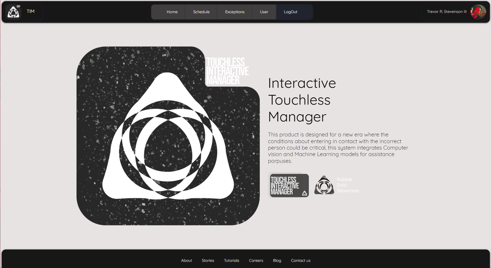
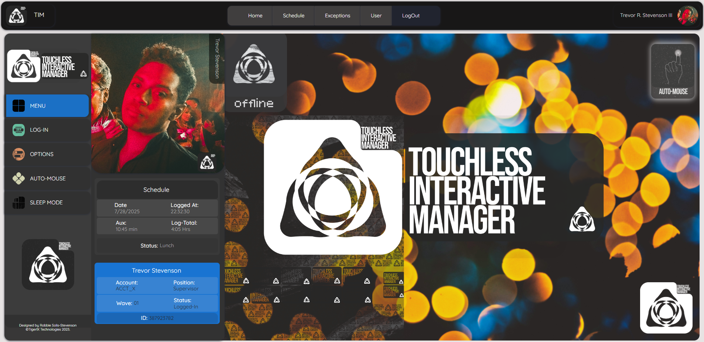

# T.I.M.

## Touchless Interactive Manager

              
            

T.I.M. (Touchless Interactive Manager), is a web-based dynamic tool that uses CV2 library for computer vision and ML to create face recognition, and hand interpreter for interactive porpuses, mainly focuses on preventing users from touching no interface in order to accomplish certain health protocols, this version of TIM is the Assistance Manager with mobile Token Auth. Originally designed to work with a raspberrypi as an IoT device, it's web version for demo porpuses resulted the best option.

> HomePage

> User Page (Offline mode)

On docker containers, the EngineServer uses Open Cv2 on Python3.11 with face_recognition modules and QOTT decoding for transfering information to the backend(Node.js - express app), front end(React Node) to be chaged to react-next.js on next version.

The system decodes a face recognition utilizing the 128 landkmarks and sends API call through Python engineServe to MongoDB(originally on SQL Server) to get the userID that will be fetched through SQL(thorugh the backEnd)L to get as a result a User object that contains the modular information of the person recognized, that will be served to the front-end.

Once the Identity of the user is confirmed, the back end will send a request to a mobile app, that will simply send a token to the app where the user will have to do a 2step verification, to confirm the access, on Y/N slection. with that response the back end will automatically send a response to the back end that will with cookies anable the users access to the navigation page, where the user could then give option to the console withput tpuching the screen, making it pasobiel for the user to clock in, change status, log out, etc.

